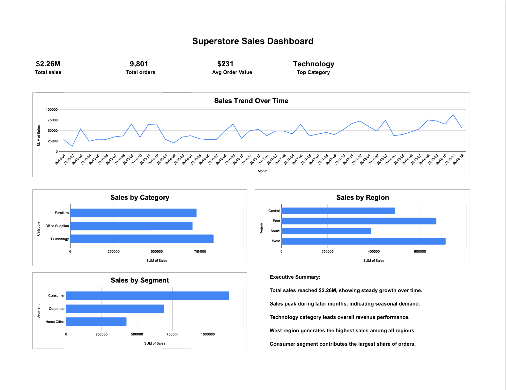

# 📊 Superstore Sales Dashboard (Google Sheets)

## 📌 Project Overview

This project analyzes retail sales data to understand business performance across time, product categories, regions, and customer segments.
An interactive dashboard was built in Google Sheets to present key insights in a clear and visual way.

---

## 🎯 Objectives

* Analyze sales trends over time
* Identify top-performing product categories
* Compare sales performance across regions
* Understand customer segment contribution
* Present findings in a dashboard format for decision-making

---

## 📂 Dataset

* Source: Superstore Sales Dataset (Kaggle)
* Records: ~9,800 transactions
* Key fields: Order Date, Sales, Category, Region, Segment

---

## 🛠️ Tools Used

* Google Sheets
* Pivot Tables
* Data Cleaning & Transformation
* Data Visualization

---

## 🧹 Data Preparation

* Cleaned inconsistent date formats (US/EU formats)
* Created a standardized date column
* Extracted Month and Year for time-based analysis
* Structured data for pivot table analysis

---

## 📈 Dashboard Features

* **KPIs:** Total Sales, Total Orders, Average Order Value, Top Category
* **Sales Trend:** Monthly sales performance over time
* **Category Analysis:** Sales by product category
* **Regional Analysis:** Sales distribution across regions
* **Segment Analysis:** Customer segment contribution

---

## 📊 Key Insights

* Total sales reached **$2.26M**, showing steady growth over time
* Sales peak in later months, indicating seasonal demand
* **Technology** is the top-performing category
* **West region** generates the highest sales
* **Consumer segment** contributes the largest share of orders

---

## 🖼️ Dashboard Preview



---

## 📁 Project Structure

```
superstore-sales-dashboard/
│
├── README.md
├── sales_dashboard.pdf
├── sales_dashboard.png
└── sales_dashboard_clean_data.csv
```

---

## 🚀 Conclusion

This project demonstrates the ability to clean data, perform analysis, and present insights using a structured dashboard.
It reflects practical skills required for entry-level data analyst roles, including data preparation, aggregation, and business-focused reporting.
